cpu 핵심 구성 요소 3가지

- alu (산술논리연산장치) : 연산을 수행하는 장치(계산 담당하는 회로)
- 제어장치 : 명령어를 해석하고 제어신호를 내보내는 장치
  - 물론, 제어 신호를 내보내는 건 제어장치만이 아님. 다른 입출력 장치도 제어신호 보낼 수 있음.
- 레지스터(들) : 명령어 처리 전후로 값을 임시 저장하는 장치

개발자 입장에서 가장 중요한 장치는 `레지스터`

- cpu 마다 레지스터 이름, 종류, 개수 등이 달라질 수 있음.
- 그럼에도 공통 부분 존재.

## ALU

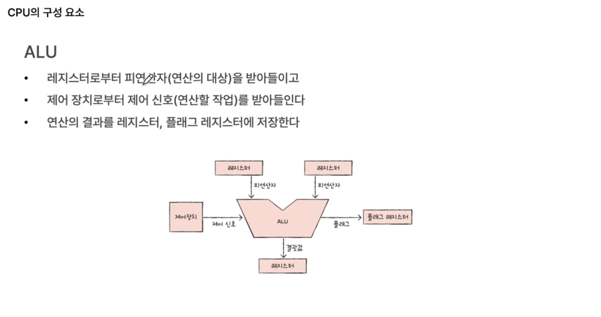

회로 묶음.

레지스터로부터 피연산자를 받음. 
제어장치로부터 제어신호를 받음. => 여기서 제어 신호란, 해야할 연산 작업. 예를 들어, `+`면 '더하라'는 명령을 받는셈. 
연산 결과는 레지스터에 저장함.

- 연산 결과에 대한 부가적인 정보들도 존재함. => 부가정보는 플래그 레지스터에 저장.
  - 예를 들어, 결과값이 레지스터보다 커질 수도 있음. 그런 경우를 오버플로우가 발생했다고 함.
  - 혹은 연산 결과가 음수인지 양수인지

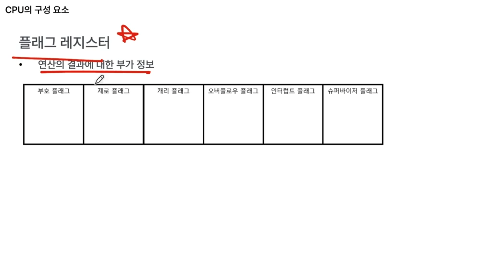

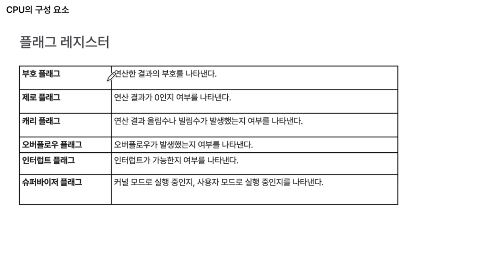

참고로 인터럽트란, cpu의 정상적인 실행 흐름을 끊는 신호.

슈퍼바이저 플래그 => 운영체제 파트에서 자세히 배움.

## 제어장치

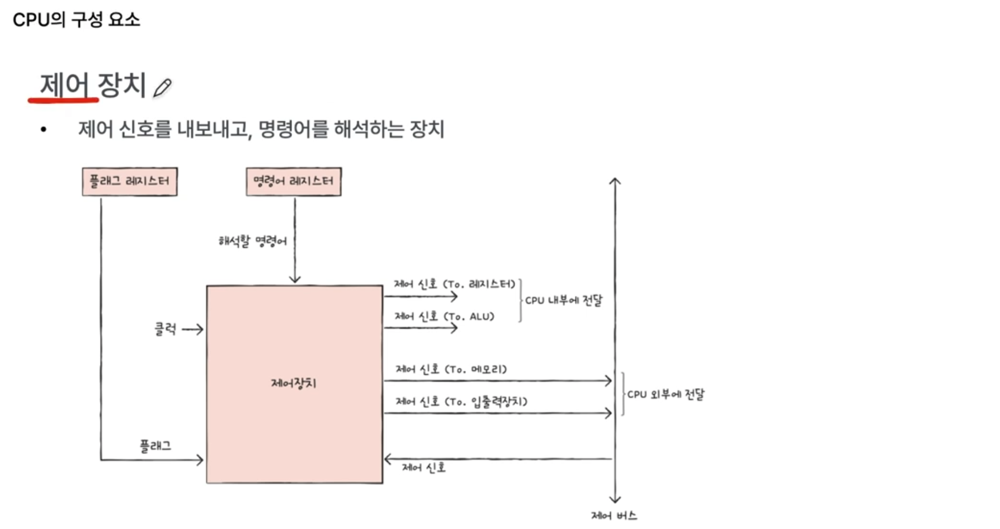

명령어 해석 시, 반드시 참고해야 하는 정보가 존재함.

- 플래그 레지스터 값을 반드시 참고해야 함. (여기에 연산 결과에 대한 부가정보가 존재하므로)
- 해석할 명령어도 참고해야 함. => 해석할 명령어가 담겨 있는 레지스터를 `명령어 레지스터(instruction register)`라고 함. 지금 당장 실행해야 하는 명령어가 담겨 있음.

클럭이라는 신호도 받아들임.

그리고 제어 신호를 내보냄.

- cpu 내부, 외부에 제어신호 전달 가능. => 제어 신호는 system bus에 전달됨.
  - 시스템 버스 안에는 내부적으로 3개의 버스 존재. (데이터버스, 주소버스, 제어버스)

### 클럭 신호

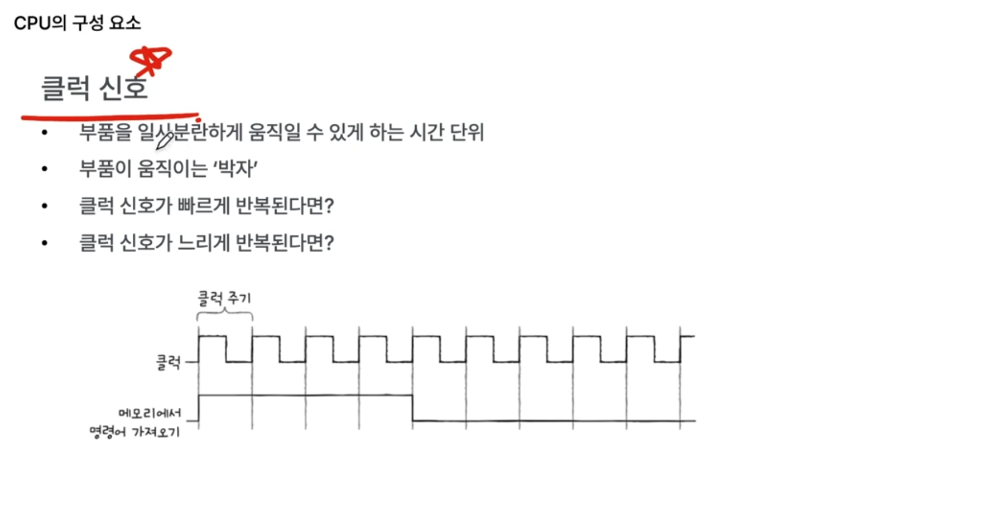

부품이 움직이는 박자.

클럭 신호는 일정한 신호는 아님.

## 레지스터

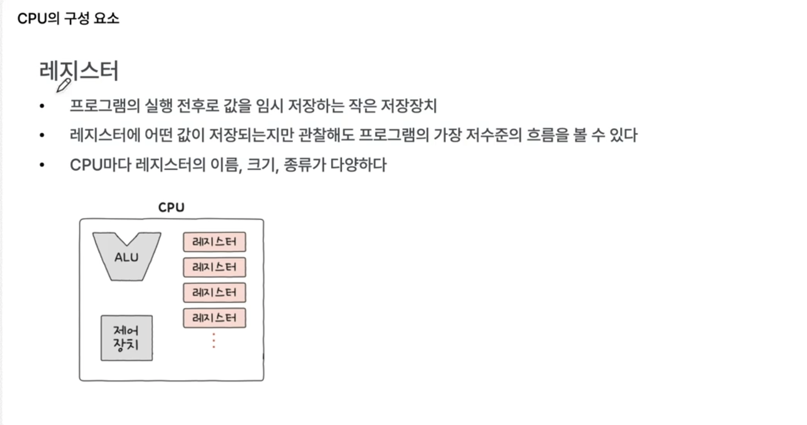

cpu마다 레지스터 이름,크기,종류 다르지만, 공통적으로 포함하는 걸 몇가지 추려보면 아래와 같음.

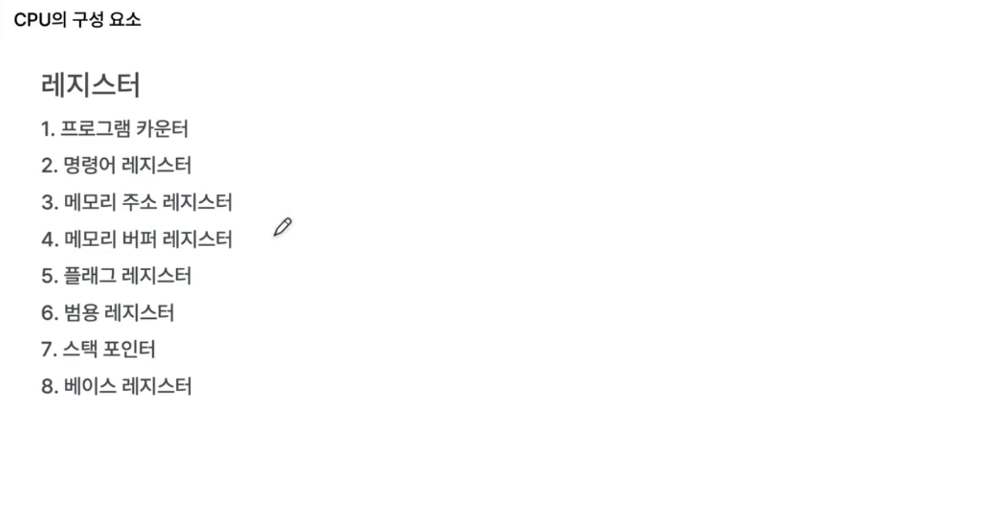

1. 프로그램 카운터 : (다음으로)메모리에서 가져올 명령어 주소 (메모리에서 읽어들일 주소)
2. 명령어 레지스터 : 해석할 명령어 (메모리에서 읽어들인 주소)
   - 제어장치가 해석함
3. 메모리 주소 레지스터 : 메모리의 주소 (읽어들일 주소 값)
   - 시스템버스를 통해 주소 정보를 주고 받아야 할 때, 여기에 담긴다.
   - 보다 정확히는, 시스템버스의 주소버스를 통해 주고 받음.
4. 메모리 버퍼 레지스터 : 메모리와 주고받을 명령어와 데이터
   - 시스템 버스는 3가지(주소버스, 데이터버스, 제어버스). 이중 `명령어와 데이터`가 `데이터버스`를 통해서 주고 받음.

프로그램 카운터는 일반적으로 1씩 증가함.

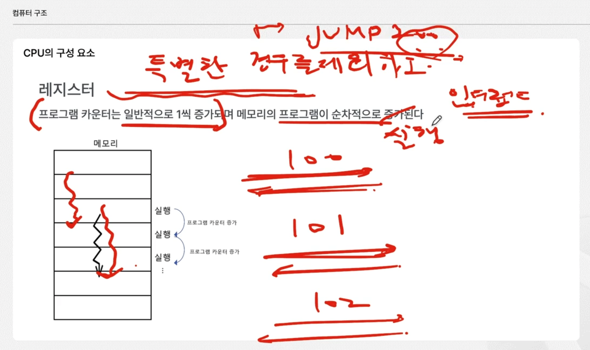

특별한 경우란?

- jump 200 같은 명령어.
- 또는 인터럽트가 발생했을 때.
- 특별한 경우라고는 했지만, 이런 경우가 빈번하게 발생함.

어쨌든 프로그램 카운터는 일반적으로 1씩 증가하므로 => 메모리 내의 프로그램이 순차저으로 실행되는 원리가 됨.

나머지 4가지

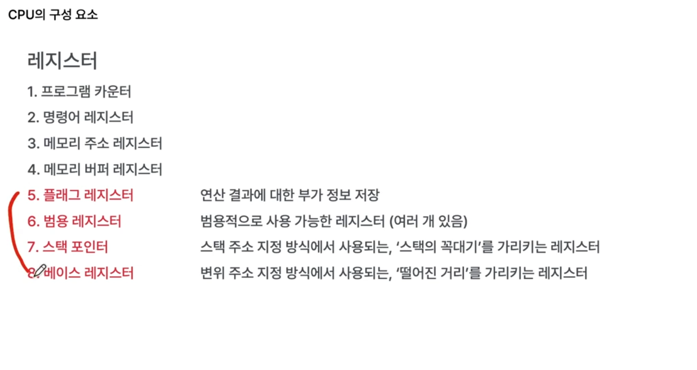

일반적으로 cpu 내에 범용 레지스터는 여러개 존재함.

- 프로그램 실행과정에서 적극적으로 사용됨.
- 연산 과정에서 연산이 많아지면 임시 저장해야 하는 값이 굉장히 많아질 수 있음. => 이럴 때 범용 레지스터가 적극적으로 사용됨.

스택 포인터, 베이스 레지스터는 주소 지정 방식에서 사용됨.

참고로 스택은 메모리 내에 존재함.

- 메모리 내에 스택처럼 쓸 수 있는 특별한 영역이 '스택'이라고 지정되어 있음.

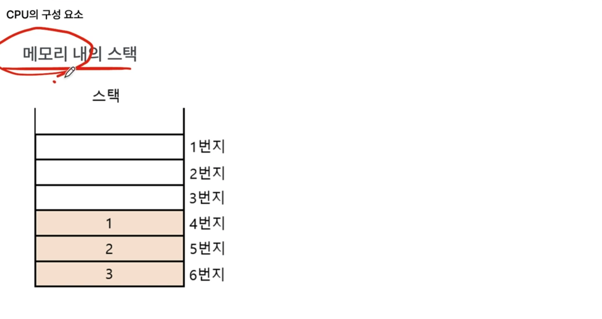

스택 포인터는 최상단을 가리킴.

스택을 활용해서 데이터를 삽입/삭제하는 방식을 스택 주소 지정 방식이라고 함.

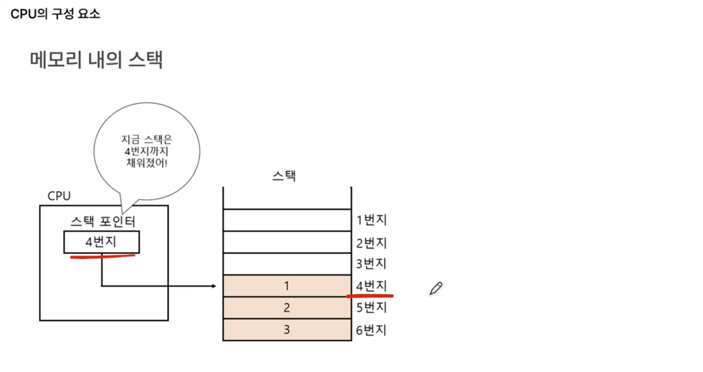

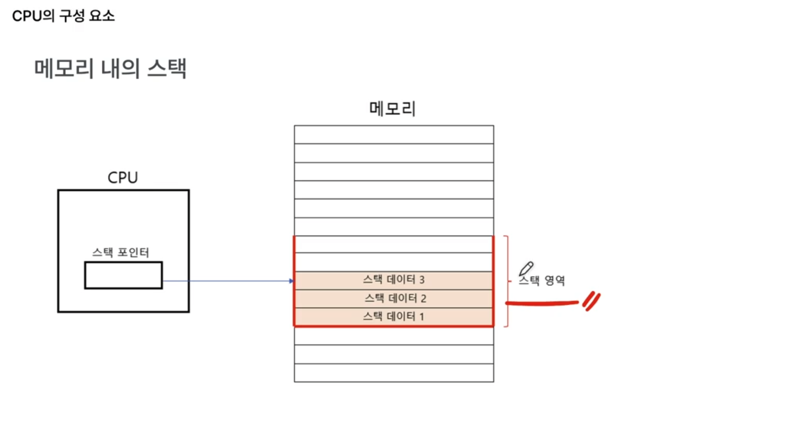

변위 주소 지정 방식

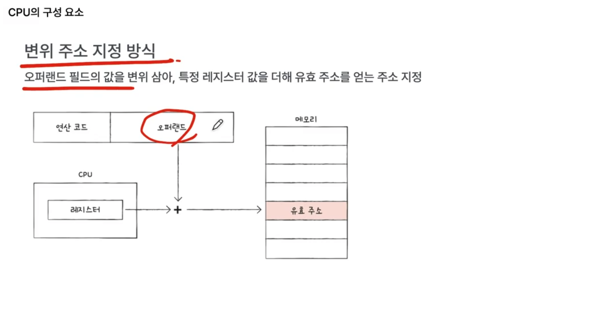

변위 주소 지정 방식에는

- 상대 주소 지정
- 베이스 레지스터 주소 지정

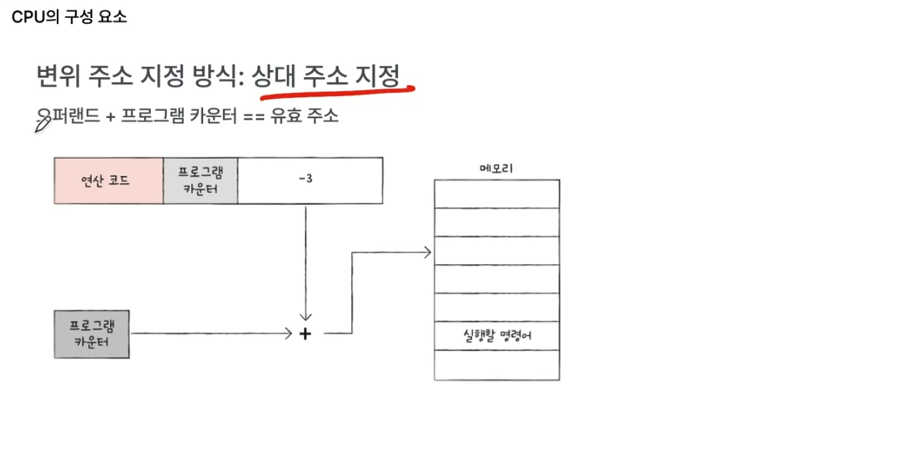

변위 주소 지정 방식이 오퍼랜드+특정레지스터값임.

- 여기서 레지스터가 프로그램 카운터면 상대 주소 지정.
- 베이스 레지스터(기준 주소)에 있는 값을 사용하면 베이스 레지스터 주소 지정.

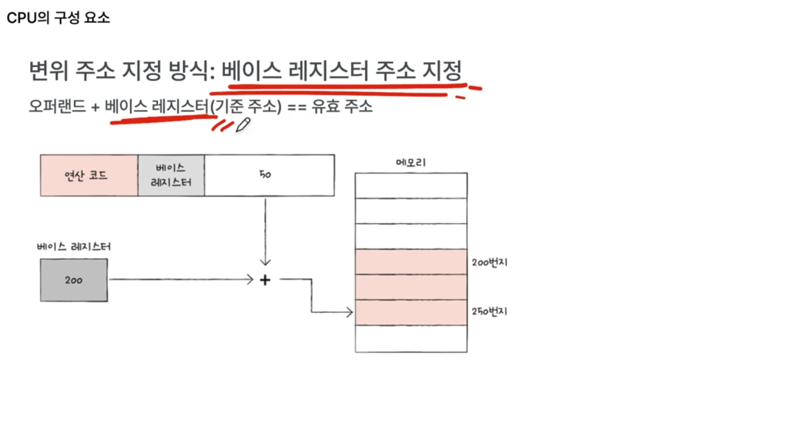

프로그램 카운터는 다음에 실행할 메모리 내 주소를 가리키고 있는 반면 
베이스 레지스터는 그 어떤 메모리 주소든 가리킬 수 있지만, 주로 베이스 레지스터를 기준 삼아서 베이스 레지스터로부터 어느 만큼 떨어져 있는 곳으로 접근해라! 이런 식으로 기준 주소로서 활용할 때 씀.
