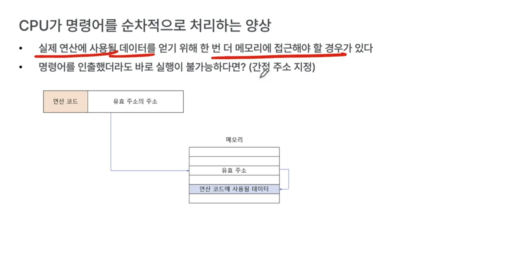
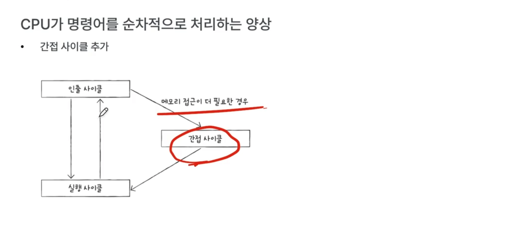
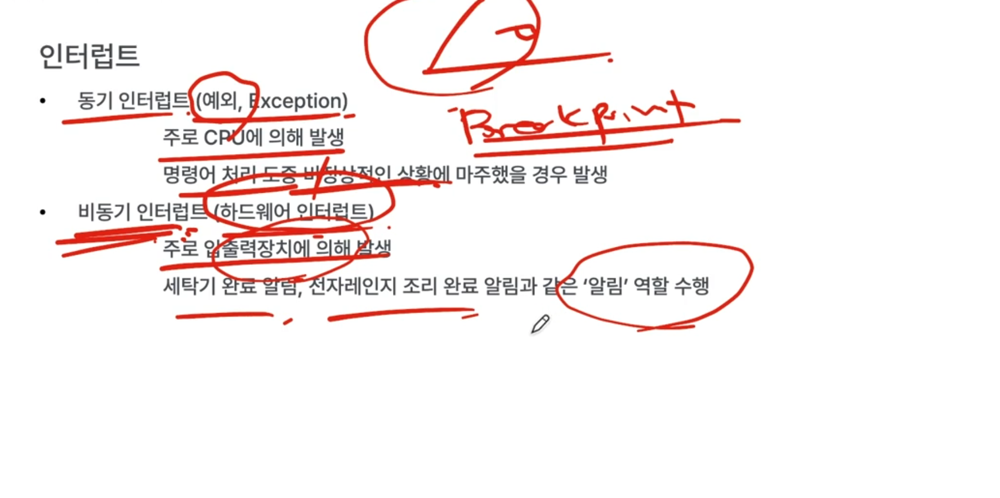
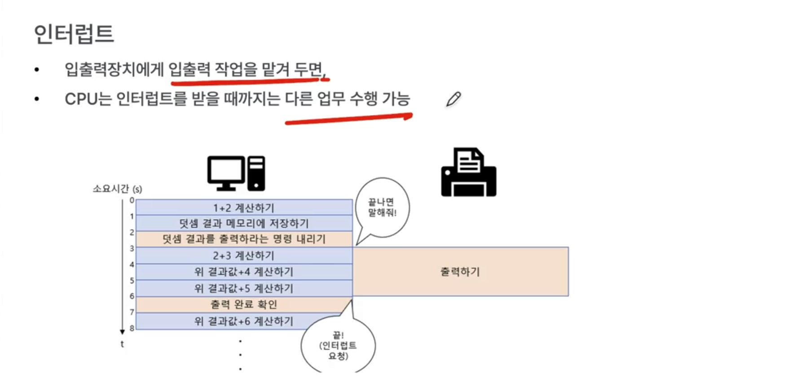
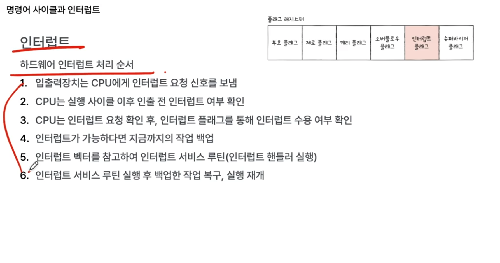
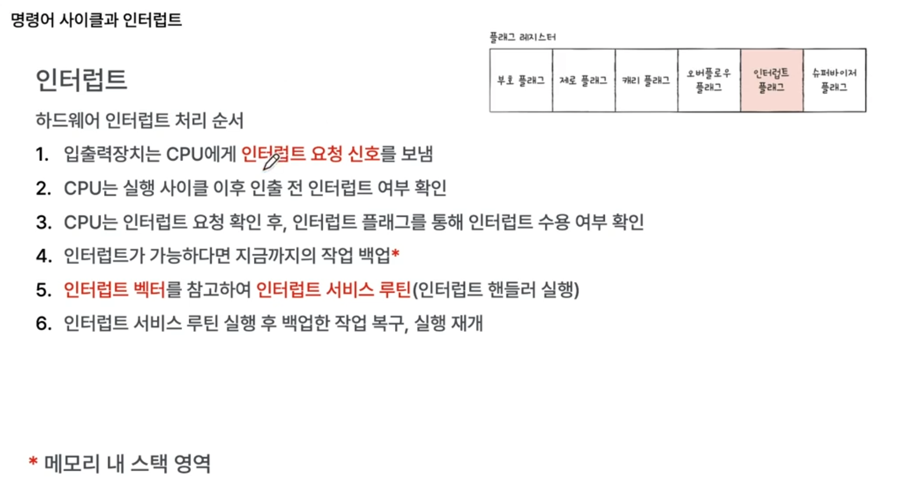
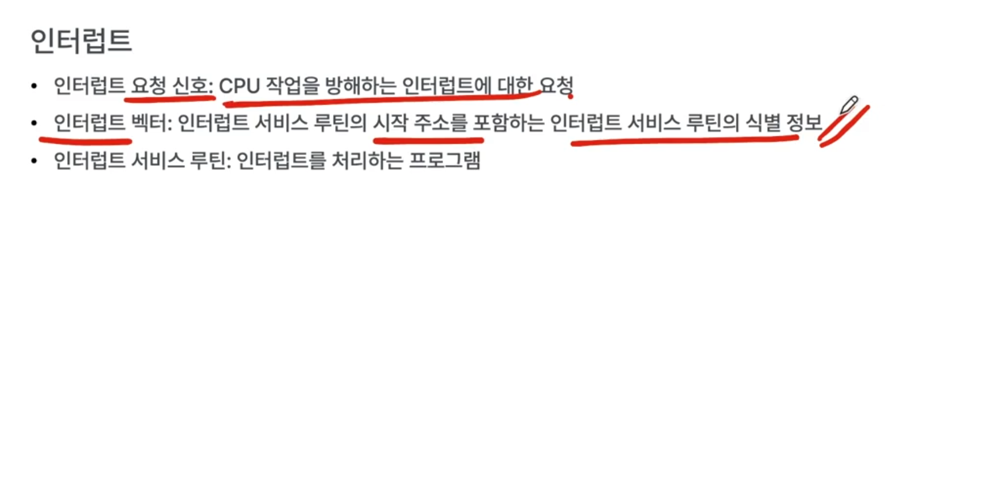
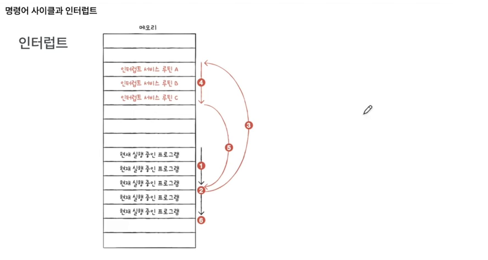
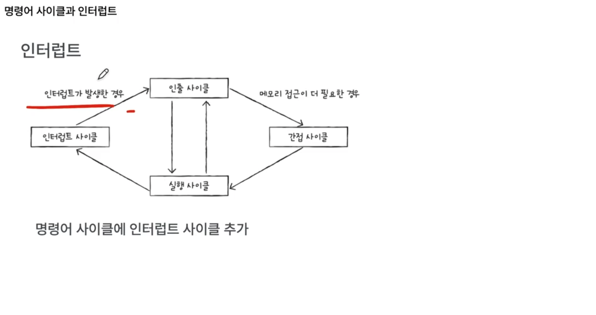

# 명령어 사이클과 인터럽트

cpu가 메모리에 있는 명령어를 실행할 때, 일정한 주기를 반복함. 그 주기를 명령어 사이클이라고 함. 
이 일정한 주기, 흐름을 끊는 게 인터럽트.

명령어 사이클 : cpu가 명령어를 처리하는 정형화된 주기,흐름

cpu가 명령어를 순차적으로 처리하는 현상

- 메모리에서 명령어 가져오고(=인출하고) `fetch` - 인출 사이클
- 가져온 명령어 실행하고 `execute` - 실행 사이클
- ... (반복)

즉, cpu는 인출 사이클과 실행 사이클을 계속 반복하며 실행.

명령어를 인출해도 바로 실행하지 못하는 경우가 존재함. (주소 지정 방식에 따라)

그래서 `간접 사이클`이 더 추가됨.

- 간단한 거면 실행 사이클만으로 충분할 것이고, 또는 실행-인출 사이클만으로 충분하겠지만
- 주소지정 방식에 따라 간접 사이클도 추가될 수 있음.

여기에다가 더해서, `인터럽트 사이클`까지 추가적으로 존재

## 인터럽트

cpu의 정상적인 실행흐름을 방해하는 신호.

exception, fault도 모두 interrupt임.

- 예를 들어, 운영체제에서 page fault, segmentation fault

인터럽트 종류는 2가지.

- 동기 인터럽트 (예외, exception)
- 비동기 인터럽트 (하드웨어 인터럽트)

디버깅할 때 break point 찍는 것도 동기 인터럽트 중 하나.

비동기 인터럽트가 존재하는 이유?

- 예를 들어, cpu가 프린터기에 요청을 했을 때, 입출력 장치에 의한 비동기 인터럽트가 없다면 cpu가 주기적으로 완료됐는지 확인을 직접해야 함. => 이렇게 주기적으로 확인하는 걸 polling이라고 함. (인터럽트의 반대개념으로 볼 수 있음)
- cpu가 polling을 하면, 불필요하게 cpu 사이클이 낭비될 수 있음.
- 즉, 비동기 인터럽트는 사이클을 불필요하게 낭비하기 않기 위한 목적임.

### 인터럽트 처리 순서

하드웨어 뿐만 아니라 대부분 인터럽트 처리 순서가 다음과 같음.

- 그리고 이 인터럽트 처리 순서는 컴퓨터구조, 나아가서 운영체제를 이해하는 데 있어 매우 중요한 개념임.

플래그 레지스터 안에 있는 `인터럽트 플래그`에는 지금 내가 인터럽트 처리할 수 있는지 여부 알 수 있음. 
인터럽트 플래그를 확인해서, 인터럽트가 가능하면 지금까지의 작업을 백업하는데,

- 어디에 백업하냐면 `메모리 내의 스택`에 저장함 (대표적으로 현재 pc(프로그램 카운터) 등)

인터럽트 서비스 루틴은, 해당 인터럽트를 처리하기 위한 특별한 프로그램.

- 입출력 완료시 이런 식으로 처리해달라, 어떤 문제 발생했을 때 어떤식으로 처리...

인터럽트 서비스 루틴도 프로그램임. 얘 또한 명령어와 데이터로 이루어져 있음.

얘까지 실행하면 이제 다시 원래 하던 작업 복구. 스택에서 pc 같은 거 꺼냄.

인터럽트 벡터는 뭐냐면,

- 인터럽트 서비스 루틴도 여러 개가 존재함. (상황별 경우의 수 혹은 입출력 장치별로 ...)
- cpu가 인터럽트를 실행하려면, 이 인터럽트가 어떤 인터럽트인지 `인터럽트 서비스 루틴의 시작주소`는 어디인지 등.

인터럽트 벡터는 이 인터럽트의 종류를 식별해줄 수 있는 정보임.

- 벡터 안에 서비스 루틴 시작주소가 들어있음. => 시작주소 참고해서 해당 인터럽트 서비스 루틴으로 jump해서 인터럽트 서비스 루틴 실행하고 다시 return.

순서 시각도

- 인터럽트 발생 전까지 pc는 1씩 증가하다가, 인터럽트 발생하면 서비스 루틴 갔다가 return.

사이클.

- 매 실행 사이클이 끝날 때마다,
  - 인터럽트 발생여부 판단. => 인터럽트 발생했으면 인터럽트 사이클 진입

