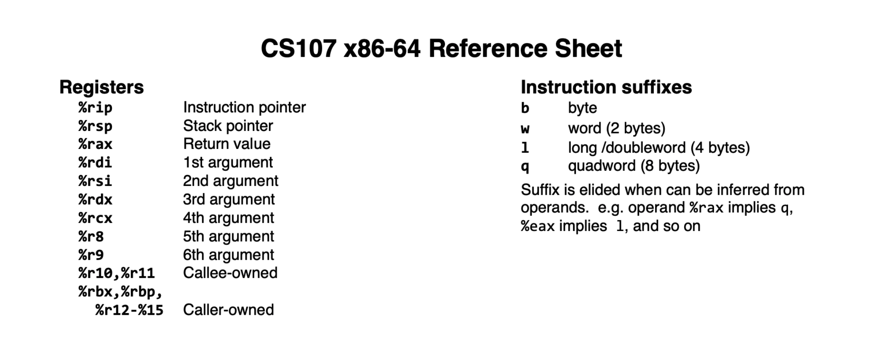
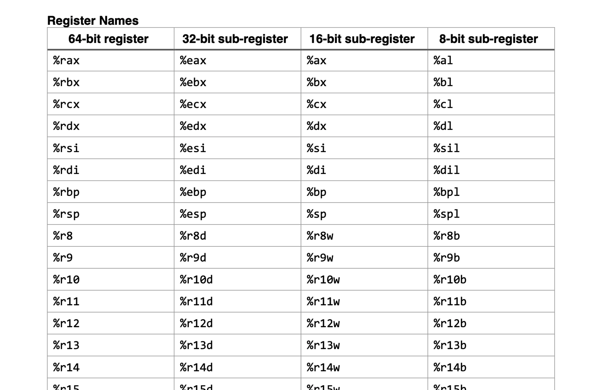

instruction pointer가 프로그램 카운터임.

위 그림은 실제 어셈블리어 관찰할 때 자주 보일 레지스터들임. 
범용레지스터의 이름라고 보면 됨.

64비트를 저장할 수 있는 레지스터가 64-bit ~로 이름을 시작함.

## References

[CS107 x86-64 Reference Sheet](https://web.stanford.edu/class/cs107/resources/x86-64-reference.pdf) 
[Guide to x86-64](https://web.stanford.edu/class/archive/cs/cs107/cs107.1202/guide/x86-64.html) 
