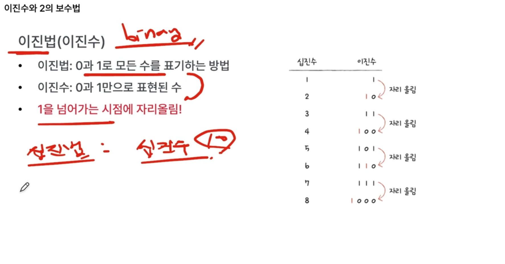
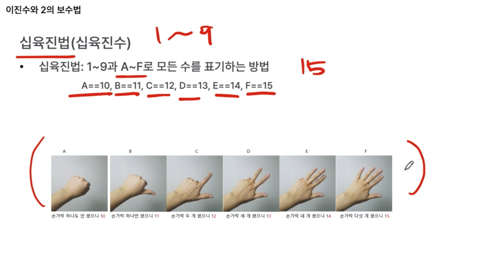
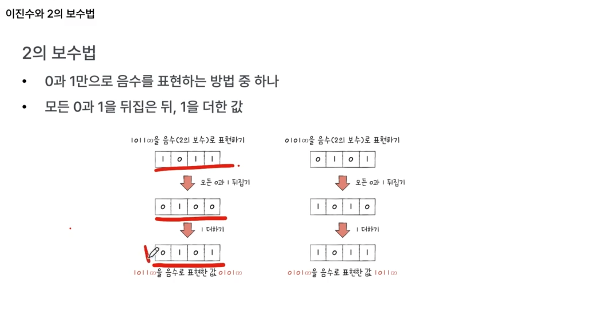
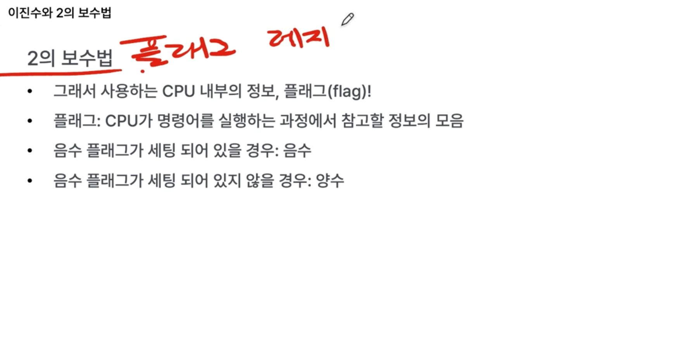

0과 1로 표현하는 방식

- 양수 : 이진수
- 음수 : 2의 보수
- 소수 : 부동 소수점
- 문자 : 문자 집합 & 인코딩 (문자 집합은 컴퓨터가 이해할 수 있는 문자 모음, 문자 모음을 이용해서 0과 1로 변환하는 과정이 인코딩. 다양한 문자 집합과 인코딩 방식 존재함.)

### 2진수로 양수 표현 - 이진법

1을 넘어가는 시점에 자리올림하는 방법임.

2진수의 단점은, 사람이 읽기에는 숫자가 너무 길어짐.

그래서 2진수 사용할 때는 16진수로 표현하는 경우가 많음.

- 16진수는 15(F)을 넘어가는 시점에 자리 올림.
- 기계어도 2진수를 16진수로 표현하기도 함 너무 길어지니까.

왜 하필 16진수?

- 2진수-16진수 간 변환이 훨씬 쉬워서

---

### 2진수로 음수표현 - 2의 보수법

2의 보수법을 음수로 간주하는 거임.

어떤 수 N을 그보다 큰 2^N에서 뺀 값.

- Ex. 11의 2의 보수는 100에서 뺀 01

컴퓨터는 음수 기호(-) 없이 0과 1로 음수를 표현해야 하므로 보수를 사용함.

음수인지 양수인지 10101만 보고 어떻게 구분? 
=> cpu 내부 레지스터(플래그 레지스터)로 구분.

