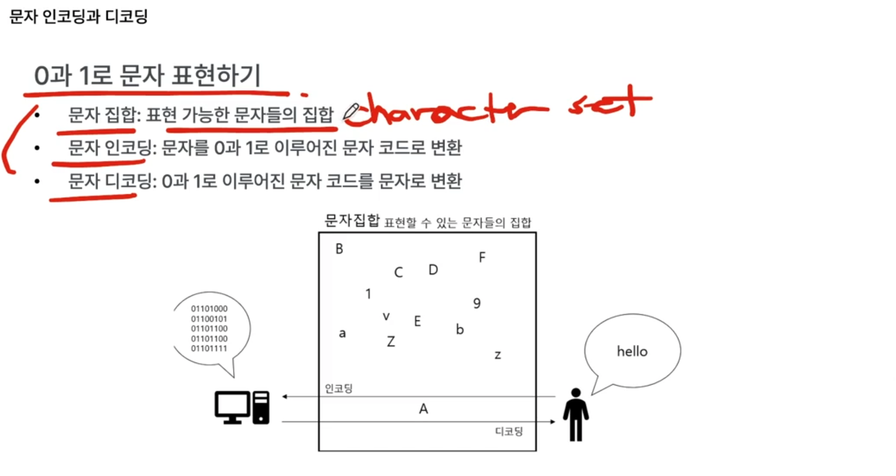

## 0과 1로 문자 표현하기.

- 문자집합(character set): 표현 가능한 문자들의 집합
- 문자 인코딩 : 문자를 0과 1로 이루어진 문자 코드로 변환
- 문자 디코딩 : 0과 1로 이루어진 문자 코드를 문자로 변환

컴퓨터는 내부적으로 인코딩된 문자들을 받아서 해석함. 
우리 화면에 보여지는 건 디코딩된 것.

문자가 깨지는 경우 => 호환되지 않는 인코딩 방식, 컴퓨터가 이해할 수 없는 문자집합 사용. 또는 A로 인코딩했는데, 디코딩할 때는 A가 아닌 B방식을 사용했다든지 쌍이 맞지 않을 때.

오늘날 절대 다수 인코딩,디코딩 방식은 영어는 거의 무조건 지원함.

## 아스키 코드

초창기 문자집합임.

- 대부분 문자집합은 아스키코드와 호환되는 경우가 많음.
- 0부터 127까지, 숫자에 문자가 대응되어 있음(알파벳,아라비아숫자,일부특수문자,제어문자)
- 대응이 곧 인코딩임. 즉 컴퓨터가 a와 97을 똑같이 인식함. (97이 문자면 a이고 숫자면 10진수 97이구나 라고 인식)

기본적으로 8bit 사용함.

- 오류 검출을 위한 1bit 제외, 사실상 7bit 사용
- 그러므로 2^7인 128개(0~127)
- 물론 8비트로 표현 가능한 `확장 아스키코드`도 존재.

## 유니코드

아스키코드의 문제점. => 한글 등 다양한 언어 표현 불가능. 7bit라서.

어떻게 해결?

- 나라마다 문자집합을 만들 수 있음. (번거로움)
- 통일된 문자집합을 만들자!해서 나온 게 `유니코드 문자집합 + utf-8 + utf-16, ...`

아스키코드 인코딩 방식은 대응 방식이었지만, 
유니코드는 같은 문자집합이라 할지라도 인코딩하는 방식이 다양함(utf-8, utf-16, ...)

이모티콘, 화살표 등까지 표현 가능. => 범용성이 높음.

https://home.unicode.org/

문자마다, `u+<4자리16진수>` 형태임.

- 4자리 16진수 값을 `코드 포인트(유니코드 문자에 부여된 고유한 수)`라고 부름

그럼 이 `코드 포인트`를 아스키코드처럼 대응하는 방식으로 인코딩하는가? => No

코드 포인트를 어떻게 인코딩하는지에 따라 유니코드 인코딩 방식이 달라짐.

- utf-8, utf-16, utf-32

https://codepoints.net/
