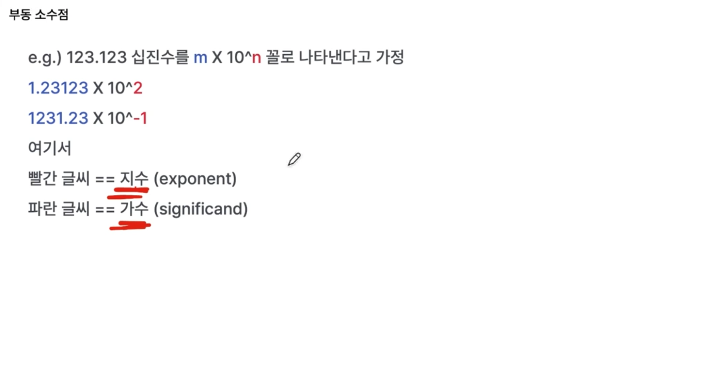
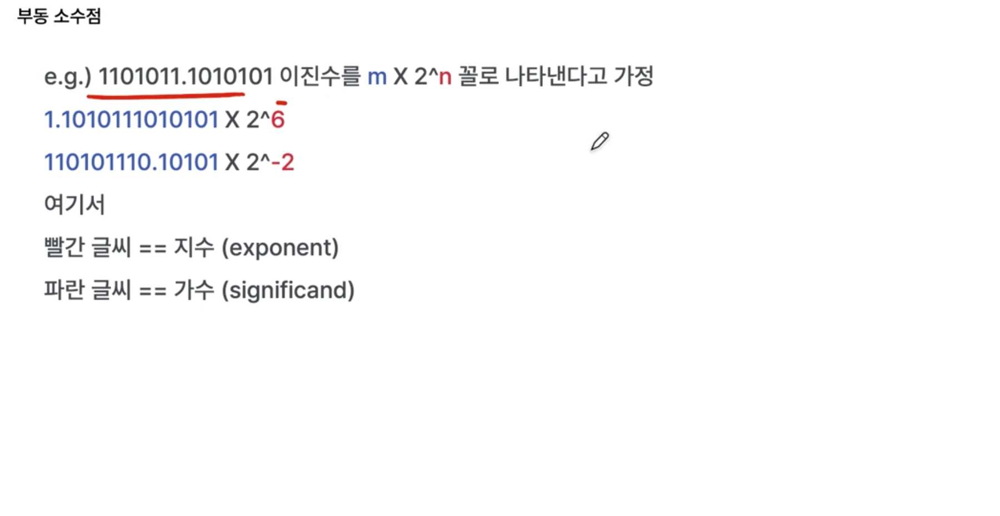
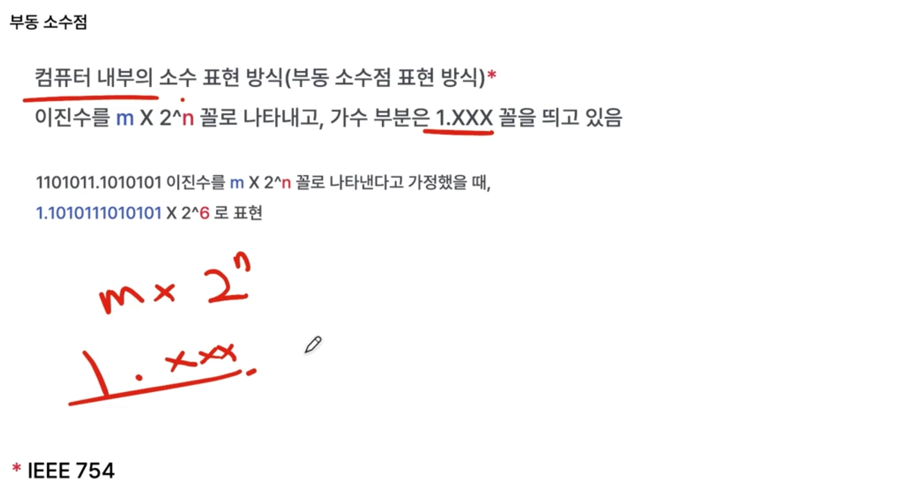
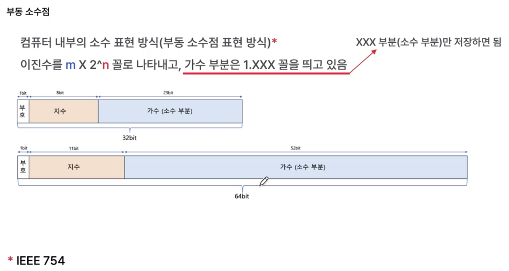
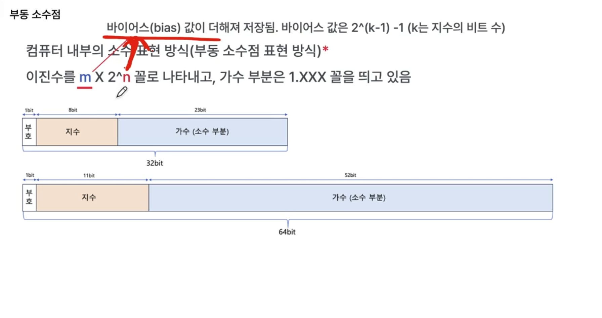
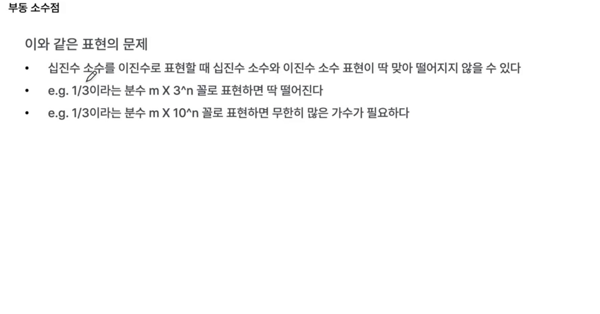
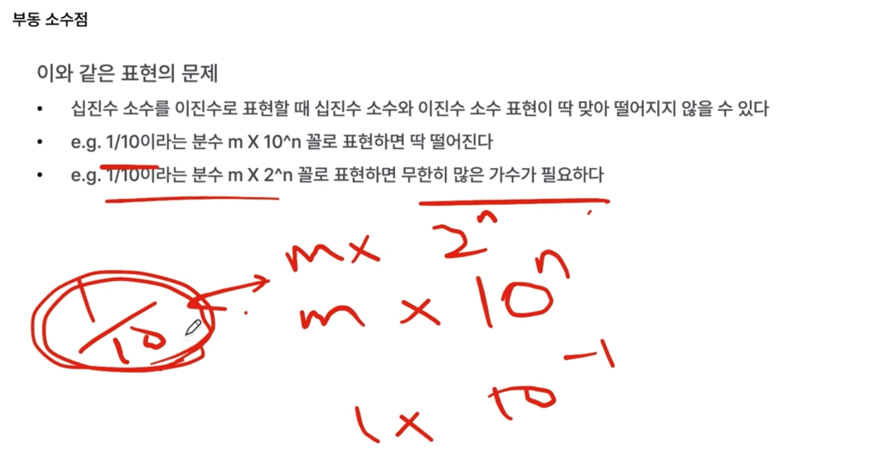

고정된 소수점 표현 방식도 존재하지만, 
오늘날 컴퓨터에서 사용하는 소수점은 부동 소수점을 의미하는 경우가 많음.

컴퓨터 내에서는 소수점을 표현하는 방식의 한계가 존재함.

- 이는 부동소수점(floating point)의 한계 때문.

부동소수점으로 2진수를 소수점으로 표현하면, 10진수 기반의 소수를 정확하게 표현할 수 없음.

'지수'와 '가수'

2진수에서도 진수, 가수가 존재함.

쉽게 생각해서, 진수가 음수면 왼쪽으로, 양수면 오른쪽으로 이동하는 개념.

하나의 숫자를 특정 지수와 가수로 표현하려면 무한히 많은 경우의 수 존재.

어차피 가수 부분은 1.XXx로 고정이므로 앞에 1은 제외하고 뒤에 Xxx만 저장해도 됨.

지수를 저장할 때는 bias 값이 더해져서 저장됨.

- 음수가 나오면 곤란하므로.

예를 들어 지수 비트에 8비트가 사용되었다면 바이어스 값은 `2^7-1`

10진수 소수와 2진수 소수의 표현이 딱 맞아떨어지지 않을 수 있음.

`1/3`이면 0.33333으로 무한히 가므로.

예를 들어, `1/10`은 10진수로 표현할 때는 딱 떨어지지만, 2진수에서는 딱 떨어지지 않으므로.

저장 공간은 한정적이므로. 
무한히 많은 가수가 나오면 일부를 버릴 수밖에 없다.

- 그래서 오차가 발생할 수 있다. `0.1+0.2 !== 0.3`
