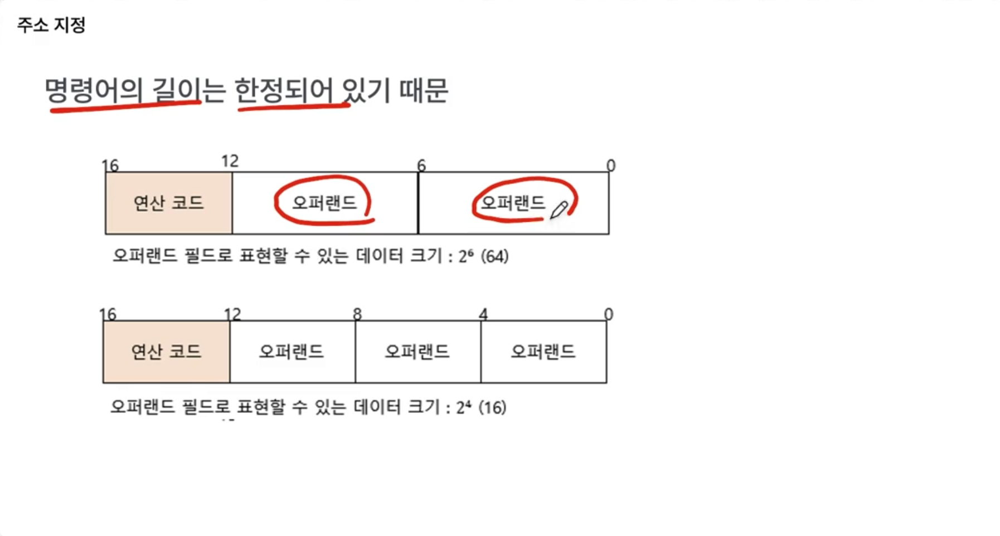
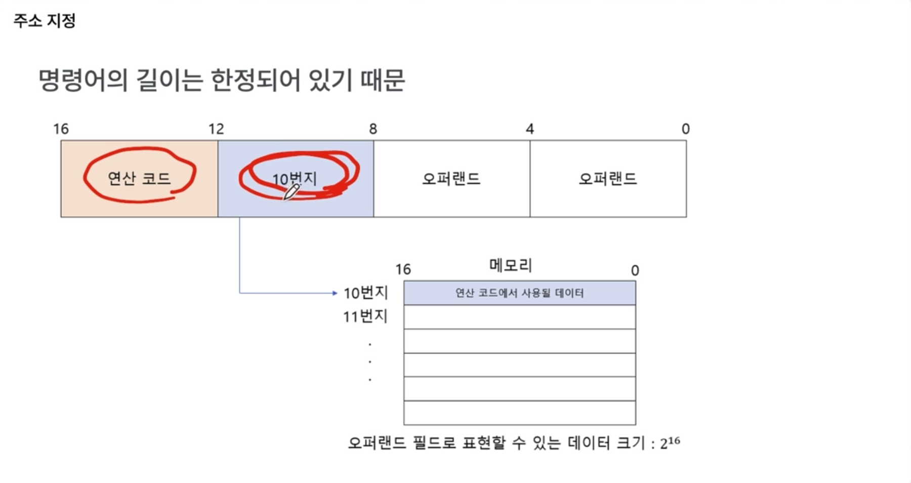
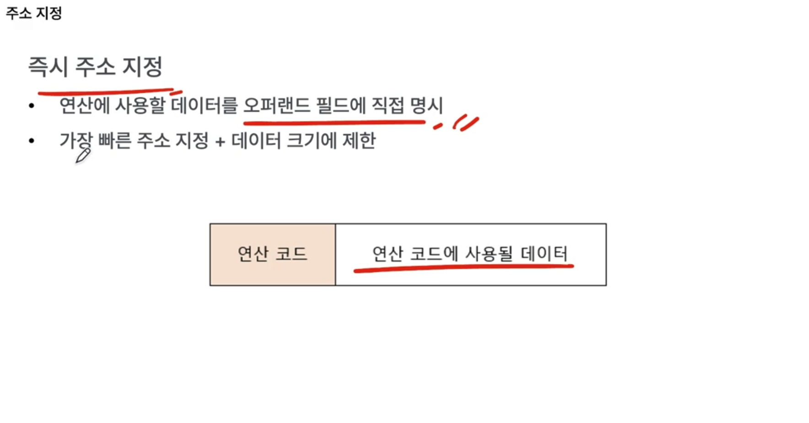
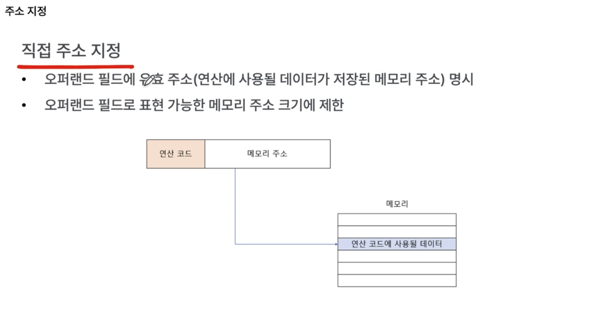
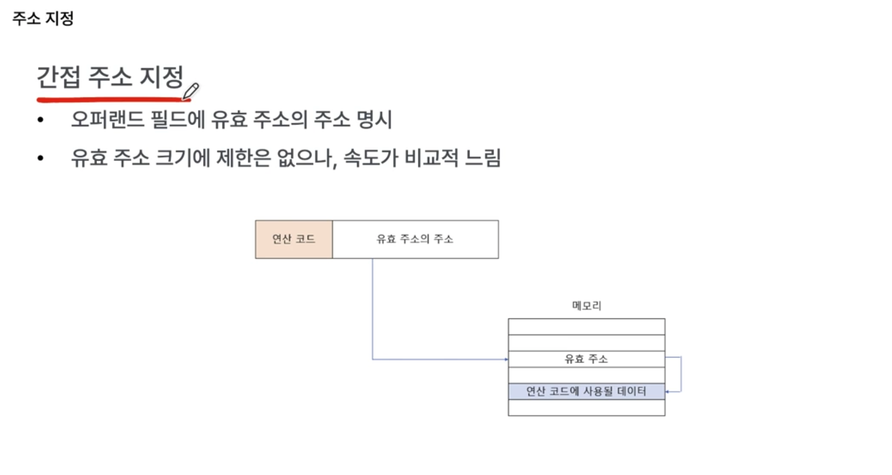
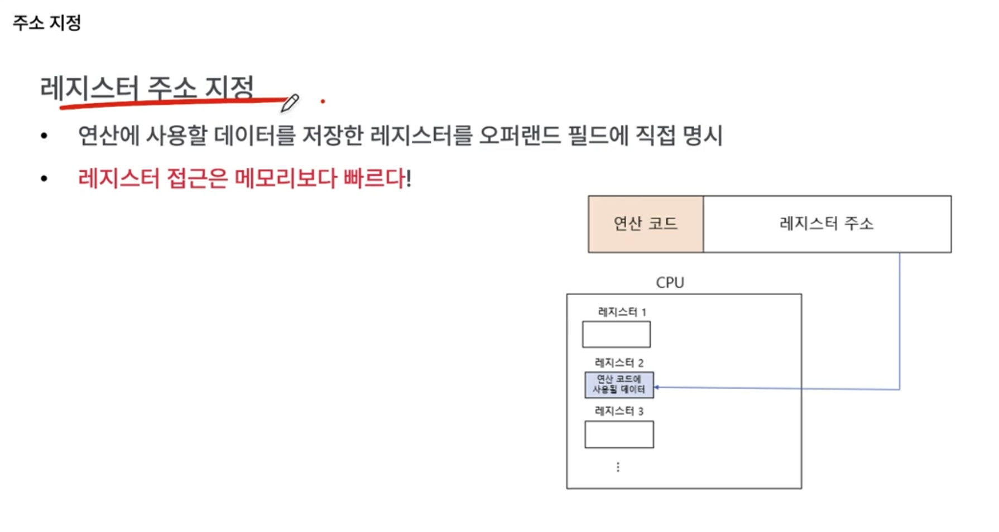
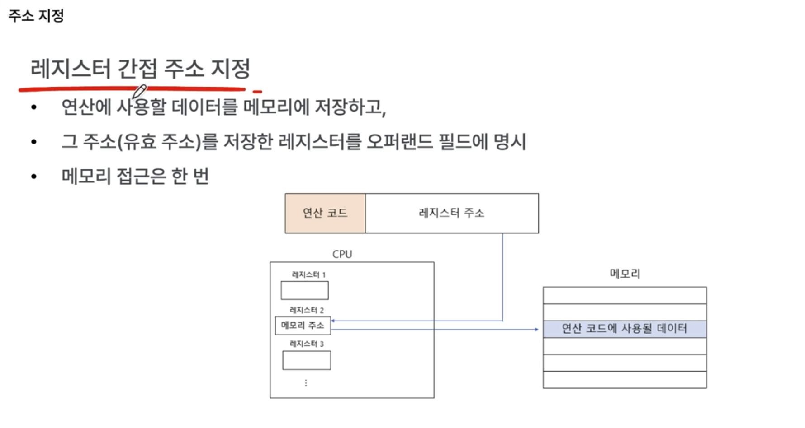

명령어가 오퍼랜드와 연산코드로 이루어져 있는데, 
연산 코드의 대상이 되는 데이터가 실제로 이 명령어 안에 없을 때, 
메모리 주소나 레지스터에 저장되어 있을 때, 어떻게 연산 코드의 대상이 되는 데이터를 찾아갈 수 있는지에 대한 내용.

즉, 주소지정은 `명령어의 연산코드의 대상이 되는 데이터를 찾아가는 방법`임.

주소지정은 Cpu마다 조금씩 차이가 존재하며, 다양한 주소지정 방식이 존재함.

오퍼랜드에는 데이터가 직접 담기기도 하지만, 대상의위치(레지스터이름,메모리주소)가 담김.

### 데이터를 직접 명시하지 않고 위치를 명시하는 이유는?

명령어의 길이가 한정되어 있기 때문임. 
예를 들어 연산코드에 사용되는 게 4비트라면, 하나의 오퍼랜드로 표현할 수 있는 크기는 2^6밖에 되지 않음 
오퍼랜드가 많아지면 많아질수록 하나의 오퍼랜드로 표현할 수 있는 크기는 점점 줄어듦.

아래와 같이 주소만 작성하면, 저장할 수 있는 데이터의 크기가 커짐.

### 주소지정

`유효주소` : 연산 코드에 사용할 데이터가 저장된 위치, 즉 연산의 대상이 되는 데이터가 저장된 위치

주소지정이란 결국, 유효 주소를 찾는 방법

- CPU마다 차이가 존재함

주소지정 방식은 다양함

1. 즉시 주소 지정

이론적으로 빠르지만, 많이 사용되지 않음.

2. 직접 주소 지정

오퍼랜드 필드에 유효 주소를 직접 명시함.

- 참고로, Cpu가 레지스터에 접근하는 속도보다 메모리에 접근하는 속도가 훨씬 느림.
- 이 방식은 메모리를 한번 거쳐야 하며, 유효주소를 필드에 직접 명시하다보니 메모리 주소 크기는 당연히 제한됨.
  

3. 간접 주소 지정

2번의 한계 때문에 등장. 유효주소의 주소를 오퍼랜드 필드에 명시하는 방식.

4. 레지스터 주소 지정

메모리가 아니라 레지스터에 저장. 메모리 접근보다 빠름.

5. 레지스터 간접 주소 지정

6. ... 그외
