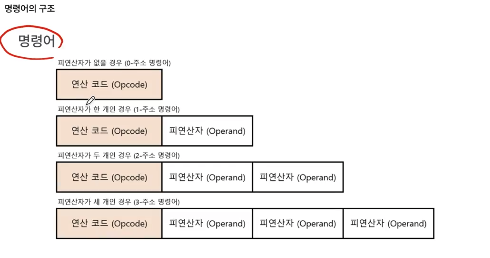
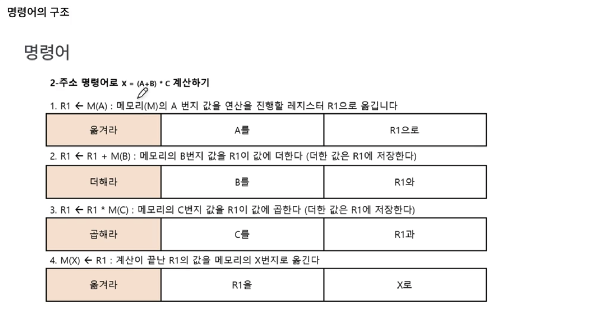
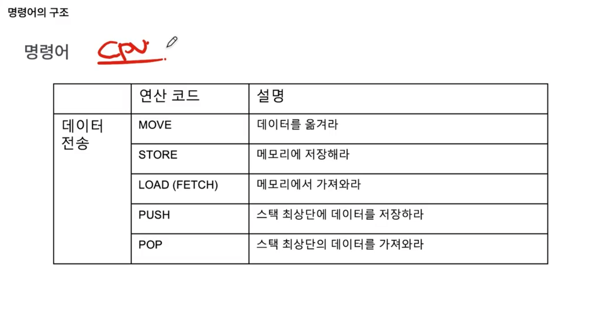
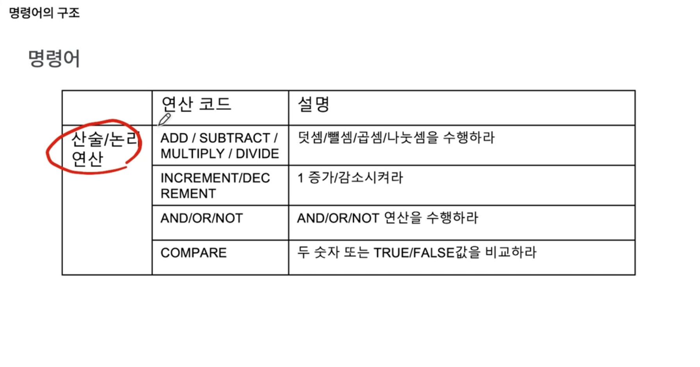
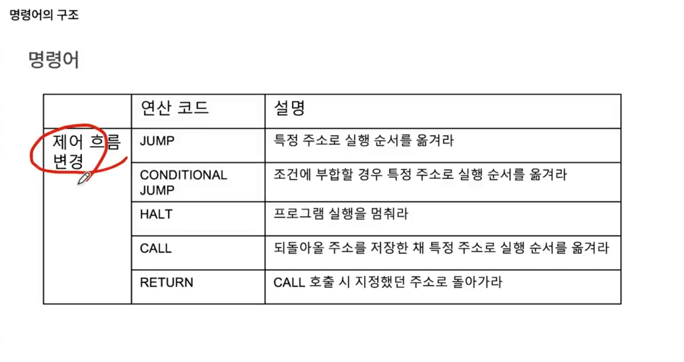
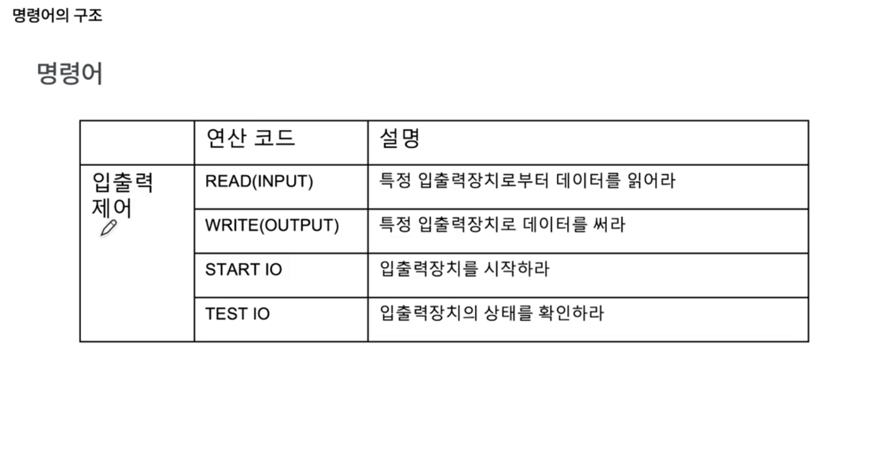

프로그램을 이루는 2가지 정보(0과 1로 이루어진 정보)

- 명령어 : 컴퓨터를 동작시키는 실질적인 정보
- 데이터 : 명령어의 대상 (재료)

명령어는 `'무엇을 대상'으로 '무엇을 수행'하라`의 구조를 띤다. 
이때, 수행할 동작에 해당하는 걸 `연산 코드(opcode)`라고 하며, 명령의 대상을 `오퍼랜드(피연산자)`라고 한다.

즉, 명령어는 "`오퍼랜드`로 `연산 코드`를 수행하라"는 구조를 갖는다.

- 오퍼랜드(operand)는 명령을 수행할 대상
  이때, 대상(데이터)이 직접 명시되기도 하고, `대상의 위치`가 명시되기도 함. 참고로 이때 대상의 위치란, 레지스터 이름, 메모리 주소에 해당한다.
- 연산코드(op-code)는 오퍼랜드로 수행할 동작

오퍼랜드는 0개일 수도 있고, 여러 개일수도 있음.

- 이를 `(오버랜드 개수)-주소 명령어`라고 표기하기도 하는데 중요하지는 않음.
  

오퍼랜드의 개수에 따라, 소스코드의 명령어 개수가 달라질 수도 있다는 점을 알아두기. 
즉, cpu든 어딘가에서 얼마나 다양한 오퍼랜드를 지원하고, 이를 쓰느냐에 따라서 같은 소스코드더라도 명령어 개수가 달라질 수 있음.

연산코드는 Cpu에 따라 종류는 다르지만, 대표적으로 쓰는 건 아래와 같다.

1. 데이터 전송에 관여하는 opcode
   - move : 데이터를 옮겨라 (일반적으로 레지스터로 데이터를 옮겨라)
   - store : 메모리에 저장하라
   - load(fetch) : 메모리에서 가져와라 (메모리에서 레지스터로)
   - push : 스택 최상단에 데이터를 저장하라
   - pop : 스택 최상단의 데이터를 가져와라  
     
2. 산술/논리 연산에 관여하는 opcode
   - add / subtract / multiply / divide : 덧셈/뺄셈/곱셈/나눗셈을 수행하라
   - increment / decrement : 증가/감소시켜라
   - and/or/not : and/or/not 연산을 수행하라
   - compare : 두 숫자 또는 true/false 값을 비교하라
     
3. 제어 흐름 변경에 관여하는 opcode
   - jump : 특정 주소로 실행 순서를 옮겨라
   - conditional jump : 조건에 부합할 경우 특정 주소로 실행 순서를 옮겨라
   - halt : 프로그램 실행을 멈춰라
   - call : 되돌아올 주소를 저장한 채 특정 주소로 실행 순서를 옮겨라
   - return : call 호출 시 지정했던 주소로 돌아가라
     
4. 입출력 제어에 관여하는 opcode
   - read(input) : 특정 입출력장치로부터 데이터를 읽어라
   - write(output) : 특정 입출력장치로 데이터를 써라
   - start io : 입출력장치를 시작하라
   - test io : 입출력장치의 상태를 확인하라
     
