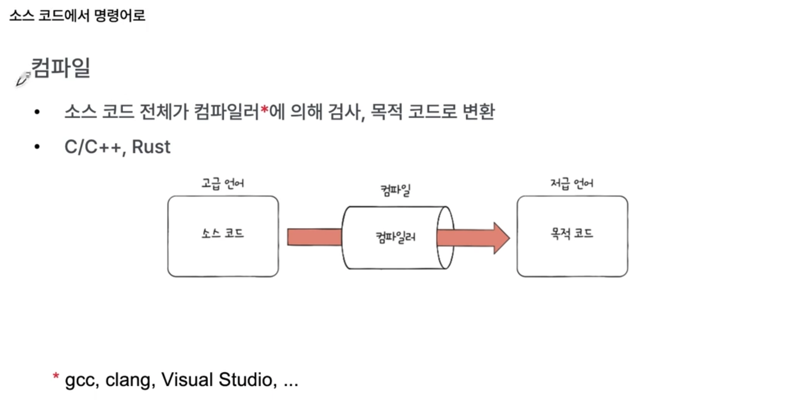
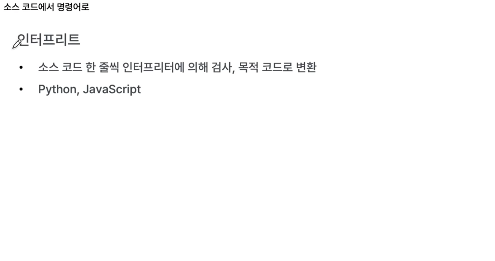

# 소스 코드에서 명령어로

컴퓨터는 명령어를 이해함. 
즉, 소스 코드는 실행되기 전 명령어(+ 데이터)로 변환되어 실행됨

- 소스코드는 사람(개발자)가 이해하기 편한 언어(고급언어)
- 명령어와 데이터는 컴퓨터가 이해하기 편한 언어(저급언어)

저급언어에는 두 종류가 존재함

- 기계어(machine code) : 컴퓨터가 직접 이해하는 언어
- 어셈블리어(assembly language)

2가지 중 사실상 컴퓨터가 이해하는 건 기계어. 
기계어를 사람이 읽기 조금이라도 편하게 변환시킨 언어가 어셈블리어.

기계어, 어셈블리어는 통일되어 있지 않음. 
CPU 또는 컴파일러 종류마다 달라질 수 있다. (즉, 고급언어를 저급언어로 변환하는 과정에서 어떤 소프트웨어를 사용하느냐에 따라 달라짐)

### 고급언어 -> 저급언어로 변환되는 대표 방식

- 컴파일
- 인터프리트

모든 언어가 2가지 방식으로 명확히 구분되는 건 아님.

컴파일러라는 프로그램에 의해 소스코드 전체가 한번에 검사됨. 
저급언어로 이루어지는 코드를 목적코드(object code)라고 함. 이걸로 변환됨.

- 컴파일러 종류도 다양함 (gcc, clang, visual studio, ...)

성능 면에서는 컴파일 방식이 더 빠르다고 알려져 있음.

### 오개념 주의

컴파일과 인터프리터 방식은 명확히 구분되는 개념이 아님. 
컴파일 언어 특성과 인터프리터 언어 특성을 모두 갖춘 언어도 존재함. (Java, python, ...)
