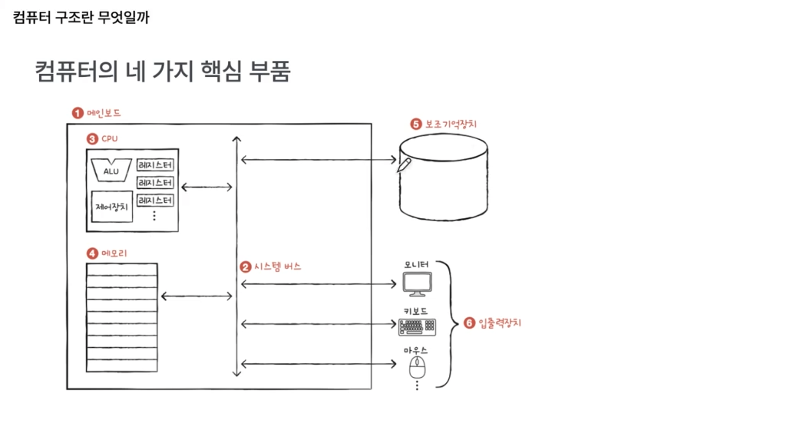

# Intro

컴퓨터 구조란, 컴퓨터 부품을 학습하는 과목

모든 프로그램은 컴퓨터 부품으로 실행됨 (성능, 용량, 비용)

- 컴퓨터 부품 중 공통적인 핵심 부품이 존재함.

### 프로그램을 이루는 2가지 정보

명령어(instruction), 데이터(data)

모든 프로그래밍 언어는 결국 명령어와 데이터로 귀결됨.

- 컴퓨터는 0과 1만 이해함
  - 명령어 : 컴퓨터를 동작시키는 실질적인 정보
  - 데이터 : 명령어의 대상(재료)

### 컴퓨터의 4가지 핵심 부품

- CPU
  명령어를 해석, 실행 담당하는 장치 
  즉, 저장 공간(메인메모리)에 있는 명령어를 CPU로 인출(Fetch)해서 해석,실행하는 장치
- 메인 메모리(& 캐시 메모리)
  실행 중인 프로그램을 저장하는 장치(전원이 꺼지면 삭제, '휘발성 저장장치') 
  참고로, 실행 중인 프로그램을 '프로세스'라고 함
- 보조기억장치
  보관할 프로그램을 저장하는 장치(전원이 꺼져도 저장 유지, '비휘발성 저장장치') 
  저장해야 하므로, 저장 용량이 큼
- 입출력장치
  컴퓨터 내외부와 정보를 주고 받는 장치

cpu에는 크게 3가지 내부 구성이 존재

- 레지스터 : CPU 내부에 있는 작은 임시 저장장치 (레지스터들 or register bank or register set)
  연산 결과를 임시로 저장할 때 주로 사용함
- ALU : 계산기 회로
  오버플로우 검출기 등 다양한 계산 담당하는 회로
- 제어장치 : 명령어를 실질적으로 해석하는 장치, 제어신호를 내보내주는 장치
  컴퓨터 부품에게 전기신호를 통해 어떤 동작을 하게끔 함

메인메모리에는 '주소'라는 개념이 존재.

- 주소는 위치정보. 어디에 저장할지를 위해 존재.

4가지 컴퓨터 핵심 부품을 모아서 저장하는 장치(핵심 부품 연결 기판)가 `메인보드(마더보드)`임. 
마더보드 위에는 선들이 존재하는데, 이 선들을 `버스(bus)`라고 함

- 시스템 버스. 부품 간 정보를 주고받을 통로임.

### 요약

